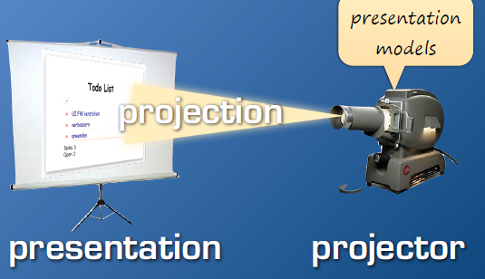
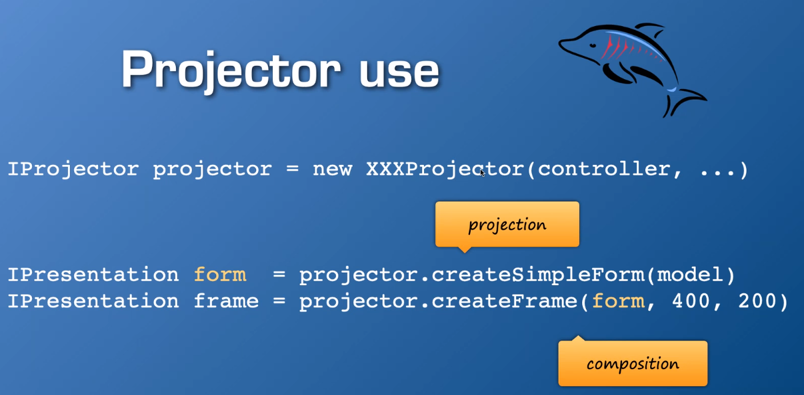
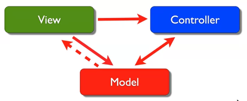
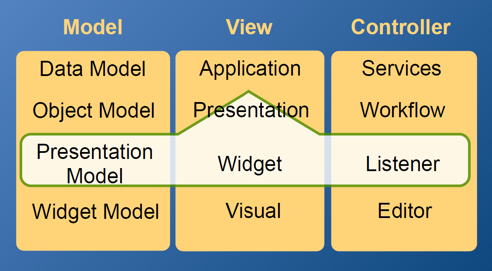

# webcl-hs20
module web clients fall semester 2020

Das Drehbuch ist in drei Teile gegliedert:
> - UI Architecture (W1-W5)
> - Custom UI Elements (W5-W10) 
> - Remoting (W11-W15)

**Evaluation:**
> * Punkte sammeln durch Beiträge im Unterricht. Sei es durch Fragen stellen oder beantworten.  
> * 50 Punkte = 6.0, 60% von den Punkten sind notwendig um das Modul zu bestehen.  
> * Punkte sind individuell auf MS Teams einzutragen unter *Notizen* im jeweiligen Wochen-Channel.  

## Week 7 SVG Canvas   
[Canvas](https://webengineering-fhnw.github.io/webcl-hs20/week7/canvas-gauge-sketch/View.html)  
[Svg-eyes](https://webengineering-fhnw.github.io/webcl-hs20/week7/svg-eyes-sketch/Eyes.html)  

**Inhalt der Vorlesung**  
> - CSS Goodie Ripple Effekt
> - Spezialaufgabe Multi-Project Planning Concept  
> - SVG & Canvas
 
**Css Goodie**  
[CSS Ripple](https://webengineering-fhnw.github.io/webcl-hs20/week7/CssRipple.html)  

**Spezialaufgabe Multi-Project Planning Concept**  
> [Figma-Prototype](https://www.figma.com/proto/TLR4g5FbkrEoQl9BcWnJGp/WebClients?node-id=72%3A2354&scaling=min-zoom)  

**Beiträge aus dem Unterricht**  
> [Mix-blend](https://developer.mozilla.org/en-US/docs/Web/CSS/mix-blend-mode)  
> [Browser-Präfix](https://www.mediaevent.de/css/browser-praefix.html)  
> [Webkit](https://developer.mozilla.org/en-US/docs/Glossary/WebKit)  
> [Custom Properties --*](https://developer.mozilla.org/en-US/docs/Web/CSS/--*)  
> [CSS Transition](https://developer.mozilla.org/de/docs/Web/CSS/transition)  
> [Keyframes](https://developer.mozilla.org/de/docs/Web/CSS/@keyframes)
> [Transition vs Animation](https://blog.hubspot.com/website/css-transition-vs-animation)

**Beantwortete Fragen zum Inhalt**  
> - Der Canvas ist super performant und braucht wenig Speicherplatz. Er ist ausserdem sehr stabil. Die Zeichnung auf dem Canvas wird über die GPU (wenn vorhanden) und nicht über die CPU gemacht  
> - Bei Geschäftsapplikationen wird häufig VanillaJs benutzt, bei Spiele würde es aber mehr Werkzeuge benötigen.
> - Für ältere Geräte hat man mit dem Canvas eine grössere Chance, dass Animationen auch gut funktionieren

## Week 6 CSS   
[Person Master-Detail View w6](https://webengineering-fhnw.github.io/webcl-hs20/week6/person/View.html)  

**Inhalt der Vorlesung**  
> - CSS Goodie material input field
> - Spezialaufgabe Pseudo Elemente und z-index  
> - Spezifisches CSS
 
**Css Goodie**  
[Todo App w6](https://webengineering-fhnw.github.io/webcl-hs20/week6/todo/View.html)  

**Spezialaufgabe Pseudo Elemente und z-index**  
> [Pseudo Elemente und z-index](https://github.com/Florian270496/WebCli_PseudoElements_ZIndex)  

**IntelliJ Tipps & Tricks**  
> Diagramm ansehen, der Abhängigkeiten zwischen Modulen zeigt: Rechtsklick auf den Ordner > Diagrams

**Beantwortete Fragen zum Inhalt**  
> - Unterschied zwischen ::before und :before [Link](https://developer.mozilla.org/de/docs/Web/CSS/::before)  
> - Shallow wrapper = verwenden nur die Observable, machen sonst nichts  
> - Controllern sind abhängig von den Projektoren
> - Kommentare: Keine auskommentierte Codes einchecken und falls doch mit einem Kommentar hinzufügen, warum dieser Code auskommentiert wurde und unter welchen Umständen es wieder auskommentiert werden kann

## Week 5 Projector Pattern    
[Person Master-Detail View w5](https://webengineering-fhnw.github.io/webcl-hs20/week5/person/View.html)  

**Inhalt der Vorlesung**  
> - Spezialaufgabe CSS Goodie Collapse  
> - Spezialaufgabe Quickstorm  
> - Master-Detail View

**Spezialaufgabe CSS Goodie Collapse**  
> [CSS Collapse](https://github.com/davidkern1/CSSGoodieCollapse)  

**Spezialaufgabe Quickstorm**  
> link folgt  

**Project Pattern**  
> Context:  
> User interfaces with potentially many screens that can be classified into typical schemes  
> Widget (Anzeigeelemente) creation and binding through UI toolkit
> Presentaion model abstraction  

> Problem:  
> Wenn man viele Screens hat, hat man auch viel Code Erstellung, Test und Verwaltung
> Das was man gebaut hat, ist super spezifisch für ein bestimmtes UI-toolkit. Bei einer Änderun, muss man dann alles neu machen.  

> Neue Idee:  
> Ein Projektor bauen, welcher unser Presentation model anzeigt. Was der Benutzer sieht ist eine Präsentation.
>   

> Lösungen:  
>   
> Reichhaltigkeit:  
> - Attribut hat ein aktueller Wert, BaseValue > Dirty state  
> - Bindable Tags: Label, Visible, Optional, Enabled, ...  

> Abstract Factory IProjector  
> - Projektoren möchte man austauschen können, einfach wenn man ein Interface hat  
> - Projektion Methoden kreiiren Ipresentations  
> - Ipräsentations sind zusammenstellbar  
> - Ipräsentation reveal inner widget  

> Projector use  
>   

> Endresultat  
>   
> Nachteil: Es ist schwierig ein Projector mit einem allgemeinen Formular zu implementieren und zu testen

**Beantwortete Fragen zum Inhalt**  
> - [Purescript] (https://www.purescript.org/)  

## Week 4 Master-Detail   
[Person Master-Detail View w4](https://webengineering-fhnw.github.io/webcl-hs20/week4/person/View.html)  

**Inhalt der Vorlesung**  
> - Spezialaufgabe JSDoc  
> - Master-Detail View Liste plus Formular  
 

**Spezialaufgabe JSDoc**  
> [JSDoc](https://github.com/alexander-eser/JSDoc_Introduction)  

**Beantwortete Fragen zum Inhalt**  
> - Hysterese: Technische Schaltung die dauernd schwingt.
    Bei einer Schaltung, in der das Einschalten dazu führt, dass es ausgemacht wird und umgekehrt. Hin und her flackern von Werten.  
>   Kann auch bei Observables passieren. Diese haben aber ein Hytereseschutz, sodass wenn man versucht, den gleichen Wert nochmal zu setzen, werden keine Benachrichtigungen verschickt.  
>   Schliesst Hyterese aber nicht vollständig aus.
> - Kommentanre: Das kommentieren, was nicht selbsterklärend ist. Zum Beispiel Werteinschränkungen.<
> - reichhaltige Attribute haben nicht nur ein Wert, sondern auch was der korrekte Wert wäre (Konvertierung, Validation), können viele unterschiedliche Properties an die sich das UI binden kann und dadurch Benachrichtigung bekommt  
> - Effizienz: an einer Stelle erstellen und auch nur an einer Stelle bewirtschaften
> - *unoffentsichtlich* =  Wird vom Benutzer nicht erkannt und oftmals auch nicht vom Programmierer

## Week 3 Attribute Projektor  
[Todo App w3](https://webengineering-fhnw.github.io/webcl-hs20/week3/todo/View.html)  

**Inhalt der Vorlesung**  
> - CSS Goodie
> - Spezialaufgabe Master-Detail View  
> - Test angeschaut  

**CSS Goodie**  
> [Dreiecke auf 2 Varianten mit CSS zeichnen](https://webengineering-fhnw.github.io/webcl-hs20/week3/CSSTriangle.html)  

**Spezialaufgabe Master-Detail View**  
> Ziel: Detail-View enthält mehr Informationen als der Master-View. Man kann bei beiden Views Änderungen machen, die bei beiden Views dann übernommen werden.  
[Master-Detail View](https://github.com/SteveVogel1/MasterDetail/View/MasterDetailView.html)  

**Testing**  
> Ziel: Beim Todo App soll bei der Änderung des Status auf *done* bei der Editierbarkeit des Textfeldes auch eine Änderung hervorgerufen werden.  
> Anwendung eines Projektors: Der Projektor mach den View und das Binding. Er erzeugt also die visuelle Präsentaiion und die Art wie der Benutzer damit umgeht.  
> todoTests implementiert

**Beantwortete Fragen zum Inhalt**  
> - Die drei Punkte in einer Klammer [...xxx] sind ein Spreat-Operator. Dieser zieht beispielsweise in einem Array das Element über mehrere Stellen.  
> - Dirty = Eine Änderung, die noch nicht gespeichert wurde.
> - DevDocs für JavaScript --> [JsDoc](https://devdocs.io/javascript/)
> - Sechs Werte, die bei javascript zu false evaluiert werden: 0, false, undefined, null, " ", NaN

## Week 2 Validationen, Konvertierungen, Attribute  
[Todo App w2](https://webengineering-fhnw.github.io/webcl-hs20/week2/todo/View.html)

**Inhalt der Vorlesung**
> - CSS Goodie  
> - MVC im Detail erklärt  
> - Tests angeschaut  
> - Spezialaufgaben 

**CSS Goodie**  
[CSS Validation](https://webengineering-fhnw.github.io/webcl-hs20/week2/CSSValidation.html)
> Wichtig! Es ist egal was wir im CSS machen es wird den html DOM nicht beeinflussen.
> CSS kümmert sich nur um die Darstellung und verändert die Struktur nicht.

**MVC Kommunikation**  

> - Model kennt den View nur indirekt. Bei einer Änderung werden alle Klassen, die sich beim Model registriert haben, informiert. Kennt sonst keine Spezialisierungen von den Views
> - View: Nach einer Änderungsmitteilung greift es auf das Model zu. Den Zugriff bekommt er über den Controller. Bei einer Änderung benachrichtigt es den Controller.
> - Controller: Benachrichtigt das Model über die Änderung im View  
> Falsche Verwendung: Jeder kennt jeden und jeder wird über alles benachrichtigt.  
> Für den Programmierer ist es dann kaum mehr nachvollziehbar, wenn ein Fehler auftritt.

**MVC Beispiel an einer Organisation zB FHNW**

> Model: Menge aller Datenbanken, die man hat  
> Views: Die verschiedenen Applikationen, die zur Verfügung gestellt wird: Evento, etc.  
> Controller: Services, die bereit gestellt wird, die drauf operieren. Sind meistens versteckt im Hintergrund  
> Und jeder von den Dreien, gliedern sich wieder auf in Model View Controller.  
> Zoom auf den View  
> 
> Der View gliedert sich dann wieder in einer MVC-Struktur, wobei M: Object Model, V: Presentasion, C: Workflow usw.  
> Es ist wichtig, dass man das nicht durcheinander bringt!  
> Wir arbeiten an der MVC-Struktur der Presentation

**Testing**
> Tests failing on purpose --> um zu sehen was zu implementieren ist  
> Test mit Debugger laufen lassen --> presentationModelTest
> * setConverter
> * setConvertedValue
> * setValidator  
> Am Ende vom Testing kontrollieren, ob der View auch noch funktioniert!

**Spezialaufgabe: Unterschied *innerText & textContent***
> TextContent rendert genau das was geschrieben ist und ignoriert html tags oder css selektoren.  
> Es ist performanter gegenüber innerText.  
> Wenn man ein Text setzen will, unanhängig von der Darstellung, dann sollte man textContent nehmen.

**Spezialaufgabe: Konvertierung & Validierung**
> 2 verschiedene Varianten  
> - V1: validierung bei der onchange methode eingefügt. invalide Inputs als invalid anzeigen, valide inputs zu uppercase ändern  
> [Version 1](https://fhnw365-my.sharepoint.com/personal/benjamin_huber_students_fhnw_ch/_layouts/15/onedrive.aspx?id=%2Fpersonal%2Fbenjamin%5Fhuber%5Fstudents%5Ffhnw%5Fch%2FDocuments%2FMicrosoft%20Teams%20Chat%20Files%2Ftodo%5Fv1%2Ejs&parent=%2Fpersonal%2Fbenjamin%5Fhuber%5Fstudents%5Ffhnw%5Fch%2FDocuments%2FMicrosoft%20Teams%20Chat%20Files&originalPath=aHR0cHM6Ly9maG53MzY1LW15LnNoYXJlcG9pbnQuY29tLzp1Oi9nL3BlcnNvbmFsL2JlbmphbWluX2h1YmVyX3N0dWRlbnRzX2ZobndfY2gvRVM5S0ZSZXdCdHhCczRxaE1vdDVUV0lCbFpSdGJjMGxyMlRaWkd4QlFCRnBMdz9ydGltZT1LUkJjMTVSdTJFZw)
> - V2: validierung bei der Methode onTextChanged. Unterschied: Texte sind von Anfang an validiert und konvertiert  
> [Version 2](https://fhnw365-my.sharepoint.com/personal/benjamin_huber_students_fhnw_ch/_layouts/15/onedrive.aspx?id=%2Fpersonal%2Fbenjamin%5Fhuber%5Fstudents%5Ffhnw%5Fch%2FDocuments%2FMicrosoft%20Teams%20Chat%20Files%2Ftodo%5Fv2%2Ejs&parent=%2Fpersonal%2Fbenjamin%5Fhuber%5Fstudents%5Ffhnw%5Fch%2FDocuments%2FMicrosoft%20Teams%20Chat%20Files&originalPath=aHR0cHM6Ly9maG53MzY1LW15LnNoYXJlcG9pbnQuY29tLzp1Oi9nL3BlcnNvbmFsL2JlbmphbWluX2h1YmVyX3N0dWRlbnRzX2ZobndfY2gvRVNBSWlveDBqM05Db0RrNnJVdllTVm9Cd2FiVlRMQ1FOUFR2c1I4R3pCU0hmZz9ydGltZT1wbGtBOFpSdTJFZw)

**IntelliJ Tipps&Tricks**
> Eine Expression evaluieren: Alt+F8  
> Bookmarks setzen: Shift + F11

**Beantwortete Fragen zum Inhalt**
> - Sind die Modelle und Controller untereinander auch getrennt: Ja. Was sein kann, ist das eine Komponente, die aus MVC besteht mit mehreren Controllern kommunizieren kann.  
> - Mit welcher Schicht sollte man am besten ein neues Projekt beginnen? --> Gehe vom Bekannten zum Unbekannten. Mit dem was man kennt anfangen und die Anderen kommen drum rum.  
> - Wir werden sass nicht behandeln
> - *Observierbar* heisst, das wir die Änderungen mitbekommen

## Week 1 Anschluss an WebPr finden  
[Todo App w1](https://webengineering-fhnw.github.io/webcl-hs20/week1/todo/View.html)  

**Inhalt der Vorlesung**
> Philosophie vom ModelViewController (MVC) repetiert  
Ziel 1: View, Controller und Model sind vollständig voneinander getrennt  
Ziel 2: alle Views sind vollständig voneinander getrennt

**Beantwortete Fragen zum Inhalt**
> - Wir werden kein Framework benutzen
> - Wir werden nicht auf die Unterschiede von den verschiedenen Frameworks eingehen.
> - Progressive WebApplication (PWA) ist normalerweise Teil vom Modul Web Programming, könnte aber in Woche 10 aufgegriffen werden, falls das Interesse da ist 
> - PWA ist auch ein Webclient
> - CSS++ steht für fortschrittliche Nutzung von CSS
> - Für Web Client werden wir nur JavaScript anschauen. Keine weitere Programmiersprachen
> - Was gilt als dependency? "Wenn du die Kontrolle über deinen Code hast, dann bist du nicht abhängig.Ein selbst gebautes Framework ist keine Abhängigkeit
> - Wir werden nich auf die Abhängigkeiten der unterschiedlichen Browser und Browser-Versionen näher eingehen
> - Wir werden nicht behandeln wie man eine Web Applikation responsive macht. --> WebEngineering
> - Wir werden automatisierte Tests anschauen
> - Es ist nicht nötig das Projekt zu forken. Man kann einfach mitprogrammieren und danach die Änderungen mit dem Code vom Herrn König überschreiben indem man den aktuellen Code vom Master-Branch pullt 
> - Kein eigentlicher Unterschied zu const Observable = v => {} und function Observable (v) {} - das Erste ist jedoch stabiler 